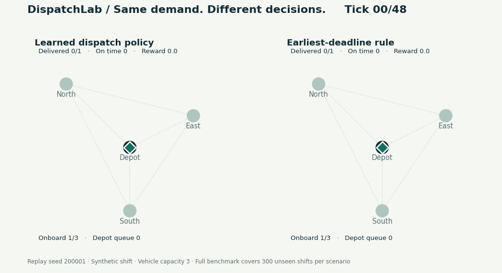
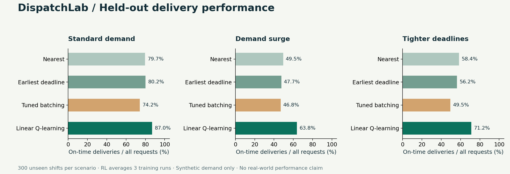
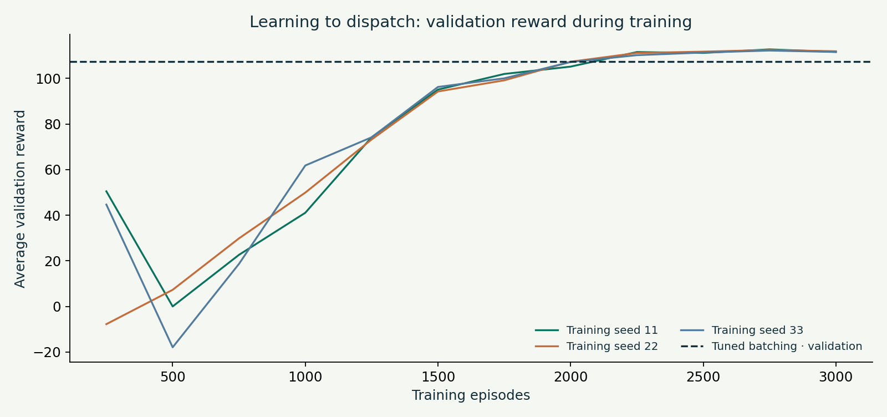

# DispatchLab

### Learning when to leave, batch deliveries, and return to the depot.

A small reinforcement-learning environment for **last-mile delivery dispatch**.
One vehicle serves three locations while new orders arrive and deadlines approach.
The project combines an inspectable NumPy learner, practical heuristic baselines,
reproducible experiments, and a visual replay.



**Measured result:** on 300 unseen synthetic shifts, the learned policies averaged
**87.0% on-time delivery**, compared with **80.2%** for earliest-deadline
scheduling. Average reward was **10.2% higher**. RL figures average three independent
training runs. These are simulator results, not real-world delivery improvements.

[Beginner walkthrough](docs/LEARNING_GUIDE.md) · [Environment rules](docs/ENVIRONMENT.md) · [Full results](docs/RESULTS.md) · [Interactive replay file](demo/index.html)

## Try it

**No Python needed to watch:** download the repository, then open
`demo/index.html` in a browser. Select a scenario, shift, and two policies.
Play, pause, or scrub through time. GitHub displays the HTML source; download it
or clone the repository to run the offline replay. It contains all data locally.

**Run the code** with Python 3.10+:

```bash
python -m venv .venv
# macOS / Linux:
source .venv/bin/activate
# Windows PowerShell instead: .venv\Scripts\Activate.ps1
python -m pip install -e '.[plots,gym]'
python -m unittest discover -s tests -v
python scripts/inspect_shift.py
```

For the exact bundled dependency versions, use Python 3.12 and
`python -m pip install -r requirements-repro.txt`, then `python -m pip install -e . --no-deps`.
The core simulator and learner require only NumPy; plotting and Gymnasium are optional.

## Why this problem needs sequential decisions

The nearest stop is not always the best next stop. Leaving immediately can waste
capacity; waiting can make an urgent parcel late. Returning now can collect
several parcels but delays those already onboard. Today's dispatch decision
changes which future deliveries remain feasible.

| Piece | Implementation |
|---|---|
| World | 1 depot, 3 delivery locations, fixed travel times |
| Capacity | 3 parcels on vehicle; 5 active orders system-wide |
| Shift | 48 ticks; arrivals stop before tick 36 |
| Observations | Time, position, transit status, waiting and onboard orders |
| Actions | Wait, return, or visit a feasible delivery destination |
| Reward | Deliveries minus travel, lateness, rejection, and unfinished-work costs |
| Learner | Linear semi-gradient Q-learning; 23 explicit state-action features |
| Baselines | Random, nearest delivery, earliest deadline, tuned batching |

The learner is **not a deep neural network or a tabular Q-table**. Its small
linear value function makes feature choices and learned weights inspectable.
Travel occupies multiple ticks; training uses a correctly discounted
semi-Markov update across each trip. No future orders are available to a policy.

## Results



Standard-demand means:

| Policy | Reward / shift | On time / requested | Completed / requested |
|---|---:|---:|---:|
| Nearest delivery | 102.89 | 79.7% | 92.8% |
| Earliest deadline | 102.95 | 80.2% | 92.6% |
| Tuned batching | 99.12 | 74.2% | 91.1% |
| Linear Q (3-run mean) | 113.45 | 87.0% | 95.9% |

Training, validation, test, and replay seeds are disjoint. Baseline batching and
model checkpoints are selected on validation only. Every policy receives the same
offered demand for a given scenario seed. Raw per-shift results and paired
bootstrap intervals are included in [the evaluation report](docs/RESULTS.md).

The strongest standard-test heuristic is earliest deadline, even though batching
won baseline validation. The table reports both rather than choosing a convenient
comparison. Results also cover higher demand and tighter deadlines without retraining.



## Reproduce the experiment

```bash
python -m dispatchlab.experiment --episodes 3000 --test-days 300 --validation-days 80
python scripts/build_demo.py
python scripts/make_assets.py
```

This trains 3 replicas (9,000 episodes total), selects checkpoints on validation,
evaluates 6,300 policy-shift combinations, and writes raw results and replay data.
Use `--output /path/to/new-run` to preserve the bundled benchmark; the two asset
scripts read the bundled repository outputs by default. No GPU, paid API, or
external dataset is required.

A small smoke run:

```bash
python -m dispatchlab.experiment --episodes 25 --test-days 5 --validation-days 5 --output /tmp/dispatchlab-smoke
```

A smoke run verifies the pipeline; it is not enough training to judge RL performance.

## Learn it, then explain it

Start with [the guide](docs/LEARNING_GUIDE.md) or
[the beginner notebook](notebooks/01_understand_dispatch.ipynb). Walk through one
state transition, understand the heuristics, then inspect the learner's update.
The notebook does not require retraining the full benchmark.

The project demonstrates environment design, action masking, delayed rewards,
capacity constraints, cost trade-offs, policy evaluation, and reproducibility.
These ideas apply to mobility, delivery operations, and other allocation problems.

## Repository map

| Path | Purpose |
|---|---|
| `dispatchlab/environment.py` | Order arrivals, travel, loading, delivery, rewards |
| `dispatchlab/agent.py` | Features, linear Q-values, learning, checkpoint IO |
| `dispatchlab/policies.py` | Simple dispatch baselines |
| `dispatchlab/experiment.py` | Training, validation, paired evaluation, replay export |
| `dispatchlab/gym_env.py` | Optional Gymnasium adapter |
| `tests/` | Timing, capacity, accounting, leakage boundaries, discounts, API checks |
| `demo/index.html` | Self-contained offline replay |
| `models/` | Learned weights and feature names in readable JSON |
| `results/` | Raw measurements and summaries |
| `docs/` | Design, learning guide, evaluation, publishing steps |

## Tests and CI

12 local tests passed, including Gymnasium's environment checker and a
valid-action trajectory comparison between the adapter and core. A GitHub Actions
workflow is included for Python 3.10 and 3.12. It will run after publication;
no remote CI run is claimed yet. See the report for the browser QA limitation.

## Scope and limitations

This is an educational simulator, not a production dispatcher. Demand is synthetic;
travel times are fixed; loading has no duration; the fleet has one vehicle. The
agent uses hand-designed features and chosen reward weights. Linear off-policy
Q-learning is not guaranteed to converge, and finite simulation gains do not
establish real-world value. The heuristics are not an optimal-routing benchmark.
All scenarios, results, and assets in this personal project use synthetic data.

Useful next steps are real demand calibration, travel-time uncertainty, nonzero
service times, a stronger optimisation baseline, and reward-sensitivity analysis.
Those are extensions, not completed features.

## License

MIT. See [LICENSE](LICENSE).
