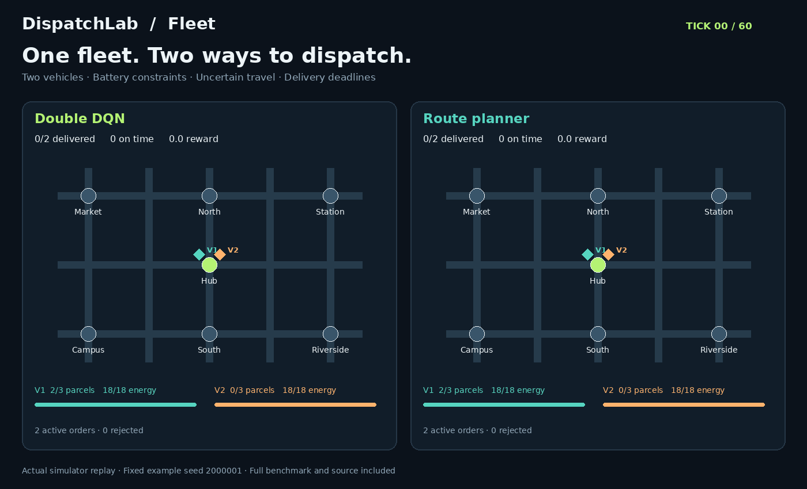
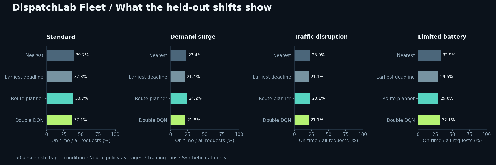
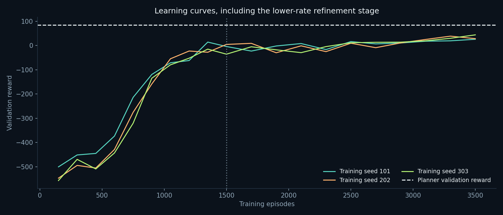

# DispatchLab

### Learning how to make better dispatch decisions, one simulated shift at a time.

I wanted to learn RL through a problem I could picture: orders arrive, a vehicle has limited room, and leaving now changes what it can deliver later. DispatchLab started with one vehicle and a small Q-learning model. I then added a second vehicle, battery limits, charging, traffic delays, and priority deliveries.

The question stayed the same: **when should a vehicle leave, where should it go, and when should it come back?**



**In standard conditions, the route planner is stronger than the neural policy in this run.** I kept the comparison and the raw results. The project is about building and evaluating a decision system properly, including finding where a simpler method works better.

[Fleet results](docs/v2/RESULTS.md) · [Environment rules](docs/v2/ENVIRONMENT.md) · [Advanced learning guide](docs/v2/LEARNING_GUIDE.md) · [Beginner version](BEGINNER.md)

## Watch it

Download the repository and open **`advanced/demo/index.html`** in a browser. It works offline. Switch policies on the same shift, change operating conditions, and scrub through the decisions. The map, batteries, order queue, event log, and scores come from the Python simulator.

GitHub displays HTML source rather than running it. The GIF plays directly in this README. Run the local app below to generate fresh shifts.

## Run it locally

Use Python 3.12 for the tested setup:

```bash
python -m venv .venv
source .venv/bin/activate
# Windows PowerShell: .venv\Scripts\Activate.ps1

python -m pip install torch==2.5.1 --index-url https://download.pytorch.org/whl/cpu
python -m pip install -e '.[advanced,plots,gym]'
python -m unittest discover -s tests -v
python -m uvicorn dispatchlab.api:app --port 8000
```

Open `http://127.0.0.1:8000` for the dashboard or `http://127.0.0.1:8000/docs` for the API docs. A fresh simulation runs the environment and policy; it does not fetch a recorded example. Tested direct dependencies are in `requirements-fleet.txt`.

The API exposes `POST /simulate`, `GET /health`, and `GET /benchmark`. A simulation request looks like:

```json
{"seed": 12345, "scenario": "demand_surge", "policy": "ddqn"}
```

This is a local demo without authentication, persistence, or a hosted deployment.

## What is in the fleet version

| Part | What it does |
|---|---|
| Simulator | Two vehicles, one hub, six destinations, capacity and deadlines |
| Energy | Tracks charging; masks trips without enough energy to return |
| Travel | Uncertain durations and service time at each stop |
| Neural policy | Dueling Double DQN in PyTorch, replay memory and target network |
| Baselines | Nearest delivery, earliest deadline and onboard route planning |
| Evaluation | Three training seeds, separate validation/test shifts, four conditions |
| Demo | Replay map, fresh simulations, fleet status, orders and decision trace |

The model chooses among 64 joint vehicle commands. It observes revealed orders and vehicle state, not future demand or future route delays. Loading follows a fixed priority/deadline rule; the agent controls dispatch rather than parcel assignment.

Training uses **rule-guided exploration**: 70% of exploratory decisions follow earliest-deadline dispatch; the rest sample a feasible command. Evaluation uses only the neural policy, without a planner fallback.

## What I measured



Each policy is tested on 150 unseen shifts under four conditions: standard demand, a demand surge, worse traffic, and reduced battery capacity. Neural results average three trained policies. Matched scenario seeds keep offered orders and the underlying route-delay field consistent across comparisons.

The [report](docs/v2/RESULTS.md) includes reward, on-time service, completion, priority service, distance, and paired confidence intervals. These are synthetic results, not company savings or real-world delivery improvements.



The first training stage struggled on validation. A lower-learning-rate refinement stage used fresh training seeds before opening the test set. It improved the retained models, but the planner remained a strong comparator. Settings, checkpoints and raw rows are included so the result can be inspected.

## Reproduce the experiment

```bash
python -m dispatchlab.fleet_experiment --episodes 1500 --validation-days 40 --train-only
python scripts/refine_fleet.py
python -m dispatchlab.fleet_experiment --evaluate-only --test-days 150
python scripts/build_fleet_release.py
```

This trains 3,500 episodes per replica, or 10,500 in total. Saved checkpoints let you run the app without retraining. After inspecting these test results, use a fresh held-out set for further model development.

## Find your way around

| Path | Purpose |
|---|---|
| `dispatchlab/fleet.py` | Fleet dynamics, energy and action masks |
| `dispatchlab/deep_agent.py` | Neural model, replay and Double DQN update |
| `dispatchlab/fleet_policies.py` | Dispatch rules and route planner |
| `dispatchlab/fleet_experiment.py` | Training, model selection and evaluation |
| `dispatchlab/api.py` | Local simulation API |
| `advanced/` | Checkpoints, raw results, dashboard and figures |
| `docs/v2/` | Design, learning guide and measured results |
| `notebooks/` | Beginner walkthrough |
| `tests/` | Simulator, model, API and adapter checks |

The original one-vehicle code and results remain available. Its 87% on-time result belongs to that original task, not the fleet model.

## Checks and limitations

Tests cover battery and parcel accounting, simultaneous travel, service timing, model updates, save/load, API validation, fresh simulations, and the original Gymnasium adapter. CI is configured to run after publication; no remote CI run is claimed yet.

The HTML structure and JavaScript syntax are checked. Local browser navigation is blocked in this execution environment, so end-to-end browser playback has not been verified. The static previews are rendered from simulator outputs.

This is my personal learning project, not a production dispatcher. The map, demand and costs are synthetic. Fleet size and loading rules are fixed, energy use is simplified, and the planner is not globally optimal. All scenarios, results, and assets are original to this repository and use synthetic data.

## License

MIT. See [LICENSE](LICENSE).
